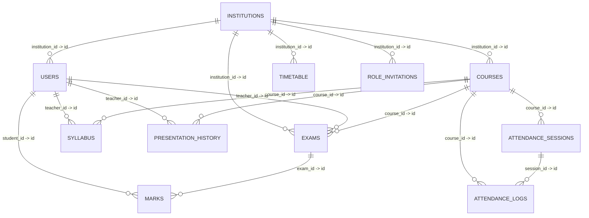

# StatCap Database Schema 🗄️

> Automatically extracted from live Supabase instance (https://lnxkmdulkhbfyxchjjdl.supabase.co) on **2026-09-07T06:19:56.034Z**.

## Overview

StatCap's persistence layer is built on PostgreSQL via Supabase. It features multi-tenant educational management with institution-level isolation, granular role-based access, automated attendance tracking, AI activity telemetry, course roadmaps, and examination analytics.

- **Total Tables:** 12
- **Total Foreign Key Relationships:** 16

## 📊 Entity-Relationship Diagram (ERD)



## 📑 Tables Index

- [attendance_sessions](#table-attendance-sessions) (7 columns)
- [syllabus](#table-syllabus) (5 columns)
- [users](#table-users) (10 columns)
- [presentation_history](#table-presentation-history) (9 columns)
- [courses](#table-courses) (30 columns)
- [timetable](#table-timetable) (6 columns)
- [exams](#table-exams) (10 columns)
- [attendance_logs](#table-attendance-logs) (5 columns)
- [role_invitations](#table-role-invitations) (8 columns)
- [ai_logs](#table-ai-logs) (14 columns)
- [institutions](#table-institutions) (8 columns)
- [marks](#table-marks) (6 columns)

---

## 🔍 Detailed Table Specifications

### Table: `attendance_sessions`

| Column | Type | Constraints | Default | Description / Reference |
|---|---|---|---|---|
| `id` | `uuid` | PRIMARY KEY, NOT NULL | `gen_random_uuid()` | This is a Primary Key. |
| `course_id` | `uuid` | NULLABLE | - | 🔗 FK `-> courses.id` |
| `teacher_id` | `uuid` | NULLABLE | - | - |
| `session_date` | `date` | NULLABLE | `CURRENT_DATE` | - |
| `qr_token` | `text` | NULLABLE | - | - |
| `expires_at` | `timestamp with time zone` | NULLABLE | - | - |
| `created_at` | `timestamp with time zone` | NULLABLE | `now()` | - |

### Table: `syllabus`

| Column | Type | Constraints | Default | Description / Reference |
|---|---|---|---|---|
| `id` | `uuid` | PRIMARY KEY, NOT NULL | `gen_random_uuid()` | This is a Primary Key. |
| `course_id` | `uuid` | NULLABLE | - | 🔗 FK `-> courses.id` |
| `teacher_id` | `uuid` | NULLABLE | - | 🔗 FK `-> users.id` |
| `content` | `jsonb` | NULLABLE | - | - |
| `updated_at` | `timestamp with time zone` | NULLABLE | `now()` | - |

### Table: `users`

| Column | Type | Constraints | Default | Description / Reference |
|---|---|---|---|---|
| `id` | `uuid` | PRIMARY KEY, NOT NULL | - | This is a Primary Key. |
| `full_name` | `text` | NULLABLE | - | - |
| `email` | `text` | NULLABLE | - | - |
| `user_type` | `text` | NOT NULL | `pending` | - |
| `institution_id` | `uuid` | NULLABLE | - | 🔗 FK `-> institutions.id` |
| `college_name` | `text` | NULLABLE | - | - |
| `semester` | `text` | NULLABLE | - | - |
| `department` | `text` | NULLABLE | - | - |
| `created_at` | `timestamp with time zone` | NULLABLE | `now()` | - |
| `division` | `text` | NULLABLE | - | - |

### Table: `presentation_history`

| Column | Type | Constraints | Default | Description / Reference |
|---|---|---|---|---|
| `id` | `uuid` | PRIMARY KEY, NOT NULL | `extensions.uuid_generate_v4()` | This is a Primary Key. |
| `course_id` | `uuid` | NULLABLE | - | 🔗 FK `-> courses.id` |
| `teacher_id` | `uuid` | NULLABLE | - | 🔗 FK `-> users.id` |
| `institution_id` | `uuid` | NULLABLE | - | - |
| `division` | `text` | NOT NULL | - | - |
| `lecture_num` | `integer` | NOT NULL | - | - |
| `lecture_title` | `text` | NULLABLE | - | - |
| `presentation_json` | `jsonb` | NOT NULL | - | - |
| `created_at` | `timestamp with time zone` | NULLABLE | `now()` | - |

### Table: `courses`

| Column | Type | Constraints | Default | Description / Reference |
|---|---|---|---|---|
| `id` | `uuid` | PRIMARY KEY, NOT NULL | `gen_random_uuid()` | This is a Primary Key. |
| `name` | `text` | NOT NULL | - | - |
| `code` | `text` | NULLABLE | - | - |
| `teacher_id` | `uuid` | NULLABLE | - | - |
| `institution_id` | `uuid` | NULLABLE | - | 🔗 FK `-> institutions.id` |
| `semester` | `text` | NULLABLE | - | - |
| `department` | `text` | NULLABLE | - | - |
| `created_at` | `timestamp with time zone` | NULLABLE | `now()` | - |
| `subject_name` | `text` | NULLABLE | - | - |
| `total_lectures` | `integer` | NULLABLE | - | - |
| `divisions` | `jsonb` | NULLABLE | - | - |
| `weekly_schedule` | `jsonb` | NULLABLE | - | - |
| `start_date` | `text` | NULLABLE | - | - |
| `end_date` | `text` | NULLABLE | - | - |
| `modules` | `jsonb` | NULLABLE | - | - |
| `exam_templates` | `jsonb` | NULLABLE | - | - |
| `taught_by` | `text` | NULLABLE | - | - |
| `past_numericals` | `jsonb` | NULLABLE | - | - |
| `exam_patterns` | `jsonb` | NULLABLE | - | - |
| `lesson_plan` | `jsonb` | NULLABLE | - | - |
| `roadmap` | `jsonb` | NULLABLE | - | - |
| `question_bank` | `jsonb` | NULLABLE | - | - |
| `active_exam` | `jsonb` | NULLABLE | - | - |
| `last_exam_date` | `text` | NULLABLE | - | - |
| `tt1_marks` | `jsonb` | NULLABLE | - | - |
| `tt2_marks` | `jsonb` | NULLABLE | - | - |
| `ese_marks` | `jsonb` | NULLABLE | - | - |
| `tt1_effective` | `jsonb` | NULLABLE | - | - |
| `tt2_effective` | `jsonb` | NULLABLE | - | - |
| `ese_effective` | `jsonb` | NULLABLE | - | - |

### Table: `timetable`

| Column | Type | Constraints | Default | Description / Reference |
|---|---|---|---|---|
| `id` | `uuid` | PRIMARY KEY, NOT NULL | `gen_random_uuid()` | This is a Primary Key. |
| `institution_id` | `uuid` | NULLABLE | - | 🔗 FK `-> institutions.id` |
| `semester` | `text` | NULLABLE | - | - |
| `department` | `text` | NULLABLE | - | - |
| `schedule` | `jsonb` | NULLABLE | - | - |
| `created_at` | `timestamp with time zone` | NULLABLE | `now()` | - |

### Table: `exams`

| Column | Type | Constraints | Default | Description / Reference |
|---|---|---|---|---|
| `id` | `uuid` | PRIMARY KEY, NOT NULL | `gen_random_uuid()` | This is a Primary Key. |
| `title` | `text` | NOT NULL | - | - |
| `course_id` | `uuid` | NULLABLE | - | 🔗 FK `-> courses.id` |
| `teacher_id` | `uuid` | NULLABLE | - | 🔗 FK `-> users.id` |
| `institution_id` | `uuid` | NULLABLE | - | 🔗 FK `-> institutions.id` |
| `semester` | `text` | NULLABLE | - | - |
| `total_marks` | `integer` | NULLABLE | `100` | - |
| `exam_type` | `text` | NULLABLE | - | - |
| `questions` | `jsonb` | NULLABLE | - | - |
| `created_at` | `timestamp with time zone` | NULLABLE | `now()` | - |

### Table: `attendance_logs`

| Column | Type | Constraints | Default | Description / Reference |
|---|---|---|---|---|
| `id` | `uuid` | PRIMARY KEY, NOT NULL | `gen_random_uuid()` | This is a Primary Key. |
| `session_id` | `uuid` | NULLABLE | - | 🔗 FK `-> attendance_sessions.id` |
| `course_id` | `uuid` | NULLABLE | - | 🔗 FK `-> courses.id` |
| `student_id` | `uuid` | NULLABLE | - | - |
| `marked_at` | `timestamp with time zone` | NULLABLE | `now()` | - |

### Table: `role_invitations`

| Column | Type | Constraints | Default | Description / Reference |
|---|---|---|---|---|
| `id` | `uuid` | PRIMARY KEY, NOT NULL | `gen_random_uuid()` | This is a Primary Key. |
| `email` | `text` | NOT NULL | - | - |
| `user_type` | `text` | NOT NULL | - | - |
| `institution_id` | `uuid` | NULLABLE | - | 🔗 FK `-> institutions.id` |
| `college_name` | `text` | NULLABLE | - | - |
| `semester` | `text` | NULLABLE | - | - |
| `created_at` | `timestamp with time zone` | NULLABLE | `now()` | - |
| `division` | `text` | NULLABLE | - | - |

### Table: `ai_logs`

| Column | Type | Constraints | Default | Description / Reference |
|---|---|---|---|---|
| `id` | `uuid` | PRIMARY KEY, NOT NULL | `gen_random_uuid()` | This is a Primary Key. |
| `action` | `text` | NOT NULL | - | - |
| `action_label` | `text` | NULLABLE | - | - |
| `teacher_id` | `text` | NULLABLE | - | - |
| `teacher_email` | `text` | NULLABLE | - | - |
| `teacher_name` | `text` | NULLABLE | - | - |
| `course_id` | `text` | NULLABLE | - | - |
| `subject_name` | `text` | NULLABLE | - | - |
| `input_tokens` | `integer` | NULLABLE | - | - |
| `output_tokens` | `integer` | NULLABLE | - | - |
| `cost_usd` | `numeric` | NULLABLE | - | - |
| `cost_inr` | `integer` | NULLABLE | - | - |
| `month` | `text` | NULLABLE | - | - |
| `created_at` | `timestamp with time zone` | NULLABLE | `now()` | - |

### Table: `institutions`

| Column | Type | Constraints | Default | Description / Reference |
|---|---|---|---|---|
| `id` | `uuid` | PRIMARY KEY, NOT NULL | `gen_random_uuid()` | This is a Primary Key. |
| `name` | `text` | NOT NULL | - | - |
| `code` | `text` | NULLABLE | - | - |
| `address` | `text` | NULLABLE | - | - |
| `created_at` | `timestamp with time zone` | NULLABLE | `now()` | - |
| `slug` | `text` | NULLABLE | - | - |
| `domain` | `text` | NULLABLE | - | - |
| `config` | `jsonb` | NOT NULL | - | - |

### Table: `marks`

| Column | Type | Constraints | Default | Description / Reference |
|---|---|---|---|---|
| `id` | `uuid` | PRIMARY KEY, NOT NULL | `gen_random_uuid()` | This is a Primary Key. |
| `exam_id` | `uuid` | NULLABLE | - | 🔗 FK `-> exams.id` |
| `student_id` | `uuid` | NULLABLE | - | 🔗 FK `-> users.id` |
| `score` | `numeric` | NULLABLE | - | - |
| `answers` | `jsonb` | NULLABLE | - | - |
| `submitted_at` | `timestamp with time zone` | NULLABLE | `now()` | - |

---

## 📜 SQL DDL Definition

You can execute this DDL in PostgreSQL or the Supabase SQL Editor to reproduce the schema:

```sql
CREATE TABLE IF NOT EXISTS public.attendance_sessions (
  id UUID PRIMARY KEY DEFAULT gen_random_uuid(),
  course_id UUID REFERENCES public.courses(id) ON DELETE CASCADE,
  teacher_id UUID,
  session_date DATE DEFAULT CURRENT_DATE,
  qr_token TEXT,
  expires_at TIMESTAMPTZ,
  created_at TIMESTAMPTZ DEFAULT now()
);

CREATE TABLE IF NOT EXISTS public.syllabus (
  id UUID PRIMARY KEY DEFAULT gen_random_uuid(),
  course_id UUID REFERENCES public.courses(id) ON DELETE CASCADE,
  teacher_id UUID REFERENCES public.users(id) ON DELETE CASCADE,
  content JSONB,
  updated_at TIMESTAMPTZ DEFAULT now()
);

CREATE TABLE IF NOT EXISTS public.users (
  id UUID PRIMARY KEY,
  full_name TEXT,
  email TEXT,
  user_type TEXT NOT NULL DEFAULT pending,
  institution_id UUID REFERENCES public.institutions(id) ON DELETE CASCADE,
  college_name TEXT,
  semester TEXT,
  department TEXT,
  created_at TIMESTAMPTZ DEFAULT now(),
  division TEXT
);

CREATE TABLE IF NOT EXISTS public.presentation_history (
  id UUID PRIMARY KEY DEFAULT extensions.uuid_generate_v4(),
  course_id UUID REFERENCES public.courses(id) ON DELETE CASCADE,
  teacher_id UUID REFERENCES public.users(id) ON DELETE CASCADE,
  institution_id UUID,
  division TEXT NOT NULL,
  lecture_num INTEGER NOT NULL,
  lecture_title TEXT,
  presentation_json JSONB NOT NULL,
  created_at TIMESTAMPTZ DEFAULT now()
);

CREATE TABLE IF NOT EXISTS public.courses (
  id UUID PRIMARY KEY DEFAULT gen_random_uuid(),
  name TEXT NOT NULL,
  code TEXT,
  teacher_id UUID,
  institution_id UUID REFERENCES public.institutions(id) ON DELETE CASCADE,
  semester TEXT,
  department TEXT,
  created_at TIMESTAMPTZ DEFAULT now(),
  subject_name TEXT,
  total_lectures INTEGER,
  divisions JSONB,
  weekly_schedule JSONB,
  start_date TEXT,
  end_date TEXT,
  modules JSONB,
  exam_templates JSONB,
  taught_by TEXT,
  past_numericals JSONB,
  exam_patterns JSONB,
  lesson_plan JSONB,
  roadmap JSONB,
  question_bank JSONB,
  active_exam JSONB,
  last_exam_date TEXT,
  tt1_marks JSONB,
  tt2_marks JSONB,
  ese_marks JSONB,
  tt1_effective JSONB,
  tt2_effective JSONB,
  ese_effective JSONB
);

CREATE TABLE IF NOT EXISTS public.timetable (
  id UUID PRIMARY KEY DEFAULT gen_random_uuid(),
  institution_id UUID REFERENCES public.institutions(id) ON DELETE CASCADE,
  semester TEXT,
  department TEXT,
  schedule JSONB,
  created_at TIMESTAMPTZ DEFAULT now()
);

CREATE TABLE IF NOT EXISTS public.exams (
  id UUID PRIMARY KEY DEFAULT gen_random_uuid(),
  title TEXT NOT NULL,
  course_id UUID REFERENCES public.courses(id) ON DELETE CASCADE,
  teacher_id UUID REFERENCES public.users(id) ON DELETE CASCADE,
  institution_id UUID REFERENCES public.institutions(id) ON DELETE CASCADE,
  semester TEXT,
  total_marks INTEGER DEFAULT 100,
  exam_type TEXT,
  questions JSONB,
  created_at TIMESTAMPTZ DEFAULT now()
);

CREATE TABLE IF NOT EXISTS public.attendance_logs (
  id UUID PRIMARY KEY DEFAULT gen_random_uuid(),
  session_id UUID REFERENCES public.attendance_sessions(id) ON DELETE CASCADE,
  course_id UUID REFERENCES public.courses(id) ON DELETE CASCADE,
  student_id UUID,
  marked_at TIMESTAMPTZ DEFAULT now()
);

CREATE TABLE IF NOT EXISTS public.role_invitations (
  id UUID PRIMARY KEY DEFAULT gen_random_uuid(),
  email TEXT NOT NULL,
  user_type TEXT NOT NULL,
  institution_id UUID REFERENCES public.institutions(id) ON DELETE CASCADE,
  college_name TEXT,
  semester TEXT,
  created_at TIMESTAMPTZ DEFAULT now(),
  division TEXT
);

CREATE TABLE IF NOT EXISTS public.ai_logs (
  id UUID PRIMARY KEY DEFAULT gen_random_uuid(),
  action TEXT NOT NULL,
  action_label TEXT,
  teacher_id TEXT,
  teacher_email TEXT,
  teacher_name TEXT,
  course_id TEXT,
  subject_name TEXT,
  input_tokens INTEGER,
  output_tokens INTEGER,
  cost_usd NUMERIC,
  cost_inr INTEGER,
  month TEXT,
  created_at TIMESTAMPTZ DEFAULT now()
);

CREATE TABLE IF NOT EXISTS public.institutions (
  id UUID PRIMARY KEY DEFAULT gen_random_uuid(),
  name TEXT NOT NULL,
  code TEXT,
  address TEXT,
  created_at TIMESTAMPTZ DEFAULT now(),
  slug TEXT,
  domain TEXT,
  config JSONB NOT NULL
);

CREATE TABLE IF NOT EXISTS public.marks (
  id UUID PRIMARY KEY DEFAULT gen_random_uuid(),
  exam_id UUID REFERENCES public.exams(id) ON DELETE CASCADE,
  student_id UUID REFERENCES public.users(id) ON DELETE CASCADE,
  score NUMERIC,
  answers JSONB,
  submitted_at TIMESTAMPTZ DEFAULT now()
);

```
